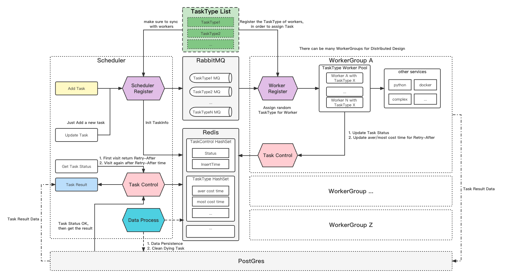

# SuperArch -- Scheduler

Scheduler of the Async Rest API

## OverAll



## Run!

Now let me tell you how to run the SuperArch

### Setup the DB tables

Setup the [DB SQL](./sql)

### Prepare the Data Middleware

```shell
/bin/bash setup/others.sh
```

P.S. You need docker installed

### Build it

```shell
go mod tidy
cd cmd && go build main.go
```

### Run the bin

```shell
./main
```

## How to Add a new Task Module

1. Write the core code in `core/`
2. Register it in `middleware/register/register.go`

So easy!

## Function

### Register

- Register the task modules
- Send Task to the Task MQ
- Get current MQ size

### TaskControl

- Init/Get/Update the Task status
- Calc suggested retry=-for time and get the current Task waiting size
- Init/Get/Update the Task type (task cost time, etc.)
- Get result from DB when task finished

### Process (Cron)

- Sync the Task type(cost time) to DB
- Clear the timeout Task

## Design Ideas

### SuperArch -- Scheduler

- Use RabbitMQ to make different Module of Tasks different task queues
- Use Reflect method to handle the Modules in single logic
- Task Status Control & Waiting List Size
- Set the interval time for obtaining task results intelligently and dynamically

### SuperArchWorker -- Worker

- *AllinOne*: A SuperArchWorker contains all the Modules, but only do one module of task which assigned to it
- *High concurrency*: Each SuperArchWorker can do many tasks with n goroutines
- *Flexable*: You can deploy many SuperArchWorkers, even use k8s
- *Compatibility*: A SuperArchWorker can do with all kinds of services, like python,docker or other complex services

## ToDo

- Fix bugs
- Draw the framework of each middleware

## Demo

[Demo Request](./test)
